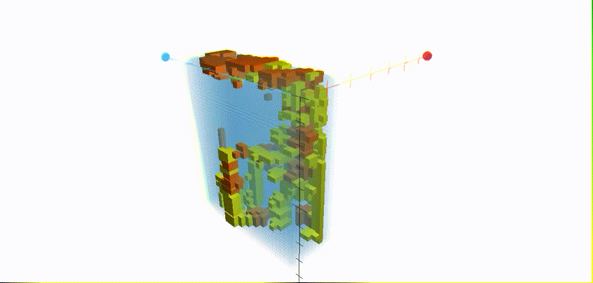

## Lithological Analysis

  
###Abstract
In environmental scientific applications and studies, we have to understand the geological lithological composition in the study area. Because of some restrictions of the situation in reality, only limited amount of data can be acquired. In order to find out the lithological distribution in the study area, many geological spatial statistical methods used to analyze the lithological composition on unsampled points or grids. This study applied the Bayesian Maximum Entropy (the BME method), which is a new method in the geological spatiotemporal statistics field. The BME method can compute the spatiotemporal correlation of the data, and integrate not only the hard data but the soft data to improve the results of estimation. The data of lithological classification is discrete categorical data. Therefore, this research attempt to apply Categorical BME to establish a complete three-dimensional Lithological estimation model. And try to regularize the maximum entropy density estimation. Apply the limited hard data from the cores and the soft data generated from the geological dating data and the virtual wells to estimate the three-dimensional lithological classification.

>Keywords: Categorical Bayesian Maximum Entropy method, Lithological Classification, Hydrogeological Setting, Regularization, Iterative scaling, Bootstrap method.

